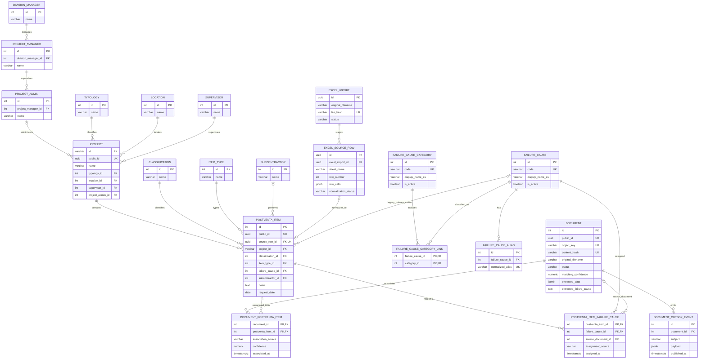

# Ingevec database ERD

This diagram reflects the current `app` schema represented by the SQLAlchemy models and Alembic migrations through revision `20260921_0015`. Analytics views are not shown as physical tables; the main view is described below the diagram.

`analytics.postventa_item_dashboard` is a reporting view built from `postventa_item`, `project`, the catalog tables, failure-cause tables, document associations, and project-manager hierarchy. It is intentionally omitted from the physical-table ERD.
