# Ingevec database ERD

This diagram reflects the current `app` schema represented by the SQLAlchemy models and Alembic migrations through revision `20261008_0024`. Analytics views are not shown as physical tables; the reporting datasets are described below the diagram and in `docs/superset-analytics.md`.

`PK` denotes a primary key, `FK` a foreign key, and `UK` a unique key. Attributes marked `nullable` are optional. Junction tables use composite primary keys. Crow's-foot relationships show whether the foreign key is required and whether multiple child rows are allowed.

```mermaid
erDiagram
    DIVISION_MANAGER ||--o{ PROJECT_MANAGER : manages
    PROJECT_MANAGER ||--o{ PROJECT_ADMIN : supervises
    PROJECT_ADMIN o|--o{ PROJECT : administers
    TYPOLOGY ||--o{ PROJECT : classifies
    LOCATION ||--o{ PROJECT : locates
    SUPERVISOR ||--o{ PROJECT : supervises
    PROJECT ||--o{ POSTVENTA_ITEM : contains
    CLASSIFICATION ||--o{ POSTVENTA_ITEM : classifies
    SPECIALITY ||--o{ SUBCONTRACTOR : classifies
    SUBCONTRACTOR ||--o{ PROJECT_SUBCONTRACTOR : assigned
    PROJECT ||--o{ PROJECT_SUBCONTRACTOR : uses
    EXCEL_IMPORT ||--o{ EXCEL_SOURCE_ROW : stages
    EXCEL_SOURCE_ROW o|--o| POSTVENTA_ITEM : normalizes_to
    FAILURE_CAUSE_CATEGORY ||--o{ FAILURE_CAUSE_CATEGORY_LINK : includes
    FAILURE_CAUSE ||--o{ FAILURE_CAUSE_CATEGORY_LINK : classified_as
    FAILURE_CAUSE_CATEGORY ||--o{ FAILURE_CAUSE_CATEGORY_GROUP_LINK : grouped_as
    FAILURE_CAUSE_GROUP ||--o{ FAILURE_CAUSE_CATEGORY_GROUP_LINK : contains
    FAILURE_CAUSE ||--o{ FAILURE_CAUSE_ALIAS : has
    FAILURE_CAUSE o|--o{ POSTVENTA_ITEM : legacy_primary_cause
    POSTVENTA_ITEM ||--o{ POSTVENTA_ITEM_FAILURE_CAUSE : receives
    FAILURE_CAUSE ||--o{ POSTVENTA_ITEM_FAILURE_CAUSE : assigned
    DOCUMENT o|--o{ POSTVENTA_ITEM_FAILURE_CAUSE : source_document
    DOCUMENT ||--o{ DOCUMENT_POSTVENTA_ITEM : associates
    POSTVENTA_ITEM ||--o{ DOCUMENT_POSTVENTA_ITEM : associated_item
    DOCUMENT ||--o{ DOCUMENT_OUTBOX_EVENT : emits

    DIVISION_MANAGER {
        int id PK
        varchar name
    }
    PROJECT_MANAGER {
        int id PK
        int division_manager_id FK
        varchar name
    }
    PROJECT_ADMIN {
        int id PK
        int project_manager_id FK
        varchar name
    }
    TYPOLOGY {
        int id PK
        varchar name
    }
    LOCATION {
        int id PK
        varchar name
        varchar geographic_zone "nullable; varchar(255)"
    }
    SUPERVISOR {
        int id PK
        varchar name
    }
    CLASSIFICATION {
        int id PK
        varchar name
    }
    SPECIALITY {
        int id PK
        varchar name
    }
    SUBCONTRACTOR {
        int id PK
        varchar name
        int speciality_id FK
    }
    PROJECT_SUBCONTRACTOR {
        varchar project_id PK, FK
        int subcontractor_id PK, FK
    }
    EXCEL_IMPORT {
        uuid id PK
        varchar original_filename
        varchar file_hash UK
        varchar status
        varchar source_sheet
        int row_count
        timestamptz imported_at
    }
    EXCEL_SOURCE_ROW {
        uuid id PK
        uuid excel_import_id FK
        varchar sheet_name
        int row_number
        jsonb raw_cells
        varchar row_hash
        varchar normalization_status
        text normalization_error "nullable"
    }
    PROJECT {
        varchar id PK
        uuid public_id UK
        varchar name
        int typology_id FK
        int location_id FK
        int supervisor_id FK
        int project_admin_id FK "nullable"
        date municipal_reception_date "nullable"
        text address "nullable"
        numeric latitude "nullable; numeric(10,7)"
        numeric longitude "nullable; numeric(10,7)"
    }
    FAILURE_CAUSE_CATEGORY {
        int id PK
        varchar code UK
        varchar display_name_es
        text description_es "nullable"
        boolean is_active
        timestamptz created_at
    }
    FAILURE_CAUSE {
        int id PK
        varchar code UK
        varchar display_name_es
        text description_es "nullable"
        boolean is_active
        timestamptz created_at
    }
    FAILURE_CAUSE_CATEGORY_LINK {
        int failure_cause_id PK, FK
        int category_id PK, FK
    }
    FAILURE_CAUSE_GROUP {
        int id PK
        varchar code UK "EJECUCION | PROPIETARIO | DISENO"
        varchar display_name_es
    }
    FAILURE_CAUSE_CATEGORY_GROUP_LINK {
        int category_id PK, FK
        int group_id PK, FK
    }
    FAILURE_CAUSE_ALIAS {
        int id PK
        int failure_cause_id FK
        varchar normalized_alias UK
        timestamptz created_at
    }
    POSTVENTA_ITEM {
        int id PK
        uuid public_id UK
        uuid source_row_id FK, UK "nullable"
        varchar project_id FK
        int classification_id FK
        int failure_cause_id FK "nullable; legacy primary cause"
        text notes
        date request_date "nullable"
        varchar handled_by "nullable"
    }
    POSTVENTA_ITEM_FAILURE_CAUSE {
        int postventa_item_id PK, FK
        int failure_cause_id PK, FK
        int source_document_id FK "nullable"
        varchar assignment_source
        timestamptz assigned_at
        varchar assigned_by "nullable"
    }
    DOCUMENT {
        int id PK
        uuid public_id UK
        varchar bucket
        varchar object_key UK
        varchar content_hash UK
        varchar original_filename
        int file_size_bytes
        varchar content_type
        varchar status
        numeric matching_confidence "nullable; numeric(5,4)"
        jsonb extracted_data "nullable"
        text extracted_failure_cause "nullable"
        text processing_error "nullable"
        timestamptz uploaded_at
        timestamptz processed_at "nullable"
    }
    DOCUMENT_POSTVENTA_ITEM {
        int document_id PK, FK
        int postventa_item_id PK, FK
        varchar association_source
        numeric confidence "nullable; numeric(5,4)"
        text rationale "nullable"
        timestamptz associated_at
    }
    DOCUMENT_OUTBOX_EVENT {
        int id PK
        int document_id FK
        varchar subject
        jsonb payload
        timestamptz published_at "nullable"
        int publish_attempts
        text last_error "nullable"
        timestamptz created_at
    }
```

`analytics.postventa_item_dashboard` is an item-level reporting view built from `postventa_item`, `project`, the catalog tables, failure-cause tables, document associations, and project-manager hierarchy. `analytics.postventa_item_cause_dashboard` is a cause/category/group-level view intended for cause analysis. `analytics.postventa_item_cause_pareto` provides filter-aware cause-level Pareto reporting. These reporting views are intentionally omitted from the physical-table ERD.

Additional unique constraints: `excel_source_row` is unique on `(excel_import_id, sheet_name, row_number)`, and `document_outbox_event` is unique on `(document_id, subject)`.

`failure_cause_group` is seeded with the three fixed groups: `EJECUCION` (Ejecución), `PROPIETARIO` (Propietario), and `DISENO` (Diseño). The codes are stable identifiers; `display_name_es` contains the accented labels `Propietario`, `Ejecución`, and `Diseño`. Group-to-category assignments are stored in `failure_cause_category_group_link`. Cause-level analytics includes these labels; because causes can have multiple categories and categories can have multiple groups, it must be treated as an item–cause–category–group grain. Group/category charts should use distinct item counts when aggregating across dimensions.

Migration `20261006_0022` clears the legacy subcontractor catalog, removes its association from `postventa_item`, and creates the speciality-to-subcontractor and project-to-subcontractor relationships. Specialities, subcontractors, and project assignments are managed directly in the database. Excel imports preserve source cells, including subcontractor text, in `excel_source_row.raw_cells`; they do not create or update subcontractor records or project assignments.

Migration `20261008_0024` removes the `item_type` catalog and `postventa_item.item_type_id`. The original workbook cells remain in `excel_source_row.raw_cells` for provenance; normalized postventa items and analytics views no longer expose item type. The migration drops the item-type catalog and assignments, so restoring them requires a database backup.
